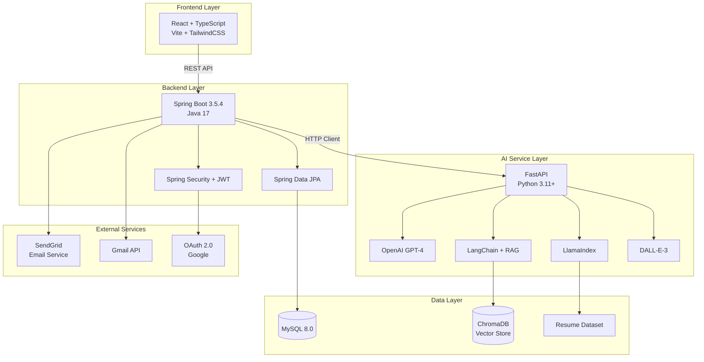
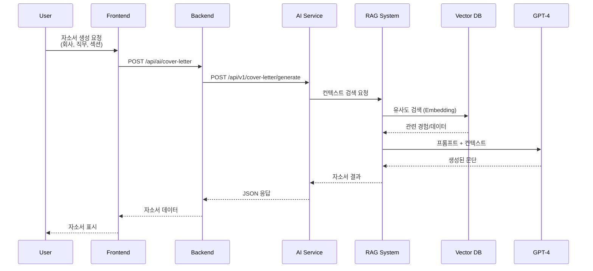
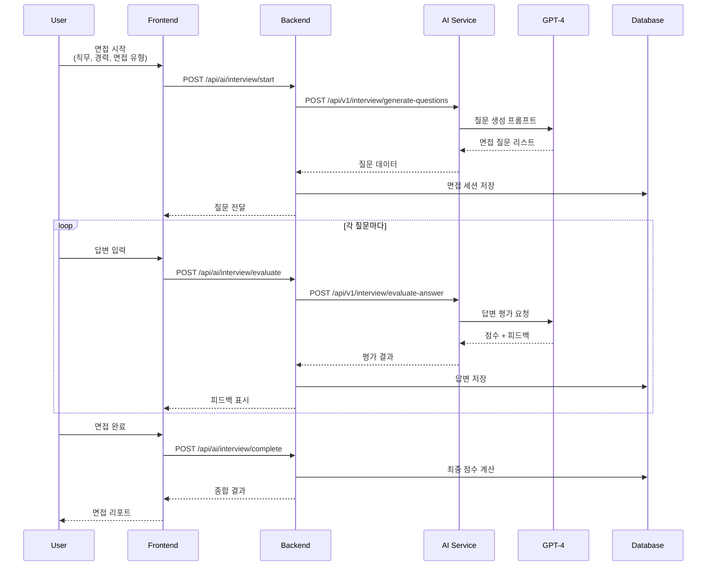
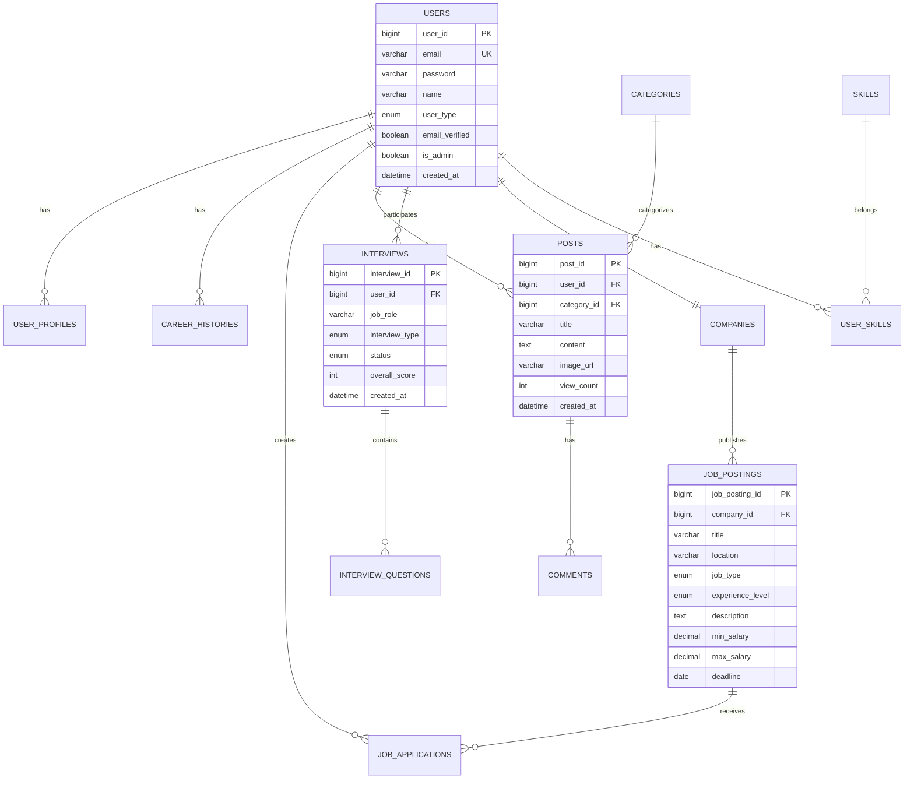

# 잡았다 (JBD) - AI 기반 맞춤형 취준생 취업 지원 플랫폼

<div align="center">


**취업 준비생의 효율적이고 개인화된 취업 프로세스를 지원하는 올인원 웹 솔루션**

[프로젝트 소개](#-프로젝트-소개) • [주요 기능](#-주요-기능) • [기술 스택](#-기술-스택) • [시작하기](#-시작하기) • [아키텍처](#-시스템-아키텍처)

</div>

---

## 📋 프로젝트 소개

### 문제 의식

현대 취업 시장에서 구직자들이 직면하는 주요 과제:

- 📊 **정보 비대칭**: 채용 트렌드의 비정형적 변화로 인한 진로 방향 설정의 어려움
- 🎯 **체계적 준비 부족**: 채용 공고 탐색 이상의 실질적 취업 준비(직무 분석, 자기소개서, 실전 연습)에 대한 수요 증가
- 🔄 **개인화 서비스 부재**: 기존 정보 제공 위주 플랫폼의 한계

### 솔루션

**잡았다(JBD)** 는 최신 생성형 AI 기술(LangChain, RAG, OpenAI)을 적극 도입하여 구직자 개개인의 데이터와 니즈를 반영한 **실질적 취업 준비를 돕는 종합 플랫폼**입니다.

---

## ✨ 주요 기능

### 🤖 AI 서비스

#### 1. **RAG 기반 맞춤 자기소개서 생성**
- LangChain + RAG 기술 기반 개인화된 자기소개서 자동 생성
- 성장과정, 장점, 지원동기 등 섹션별 데이터셋 활용
- 회사/직무별 맞춤형 컨텍스트 검색 및 문단 생성


#### 2. **OpenAI 기반 AI 모의면접 시뮬레이터**
- 직무별/경력별 맞춤 면접 질문 자동 생성
- 실시간 답변 평가 및 피드백 제공
- 기술/인성 면접 지원

**면접 유형**:
- 💻 기술면접 (Technical Interview)
- 🤝 인성면접 (Behavioral Interview)

#### 3. **AI 웹메일 번역 기능**
- 해외 취업 준비자를 위한 영문 이력서/웹메일 실시간 번역
- 10개 언어 지원 (한국어, 영어, 일본어, 중국어, 프랑스어, 독일어, 스페인어, 이탈리아어, 포르투갈어, 러시아어)
- 문서 유형별 특화 번역 (이력서, 자기소개서, 포트폴리오, 이메일)

#### 4. **DALL-E 3 이미지 생성 & SNS**
- 프롬프트 기반 이미지 즉시 생성
- 감정 분석 기반 자동 스타일 선택
- 게시글/댓글에 생성 이미지 활용 가능

**지원 스타일**: Professional, Creative, Modern, Friendly, Celebration, Motivational

#### 5. **LlamaIndex 기반 AI 챗봇**
- RAG 기반 취업 관련 질문 응답
- Resume dataset 기반 지식 제공
- 대화 히스토리 저장/관리

---

### 💼 채용 서비스

- **채용공고 관리**: 기업의 채용공고 등록 및 관리
- **맞춤형 공고 추천**: 사용자 프로필 기반 추천 시스템
- **지원 현황 관리**: 지원서 작성 및 진행 상황 추적
- **고급 검색 & 필터링**: 위치, 직무, 경력, 급여 등 다양한 조건 검색

---

### 👥 사용자 관리

- **3가지 사용자 유형**: 일반(취준생) / 기업 / 관리자
- **OAuth 2.0 인증**: Google 소셜 로그인 지원
- **기업 이메일 인증**: 사내 이메일 인증을 통한 기업 유저 전환
- **프로필 관리**: 경력, 교육, 스킬, 자격증, 포트폴리오 통합 관리

---

### 💬 커뮤니티

- **다양한 게시판**: 취업정보, 면접후기, Q&A, 자유게시판, 기업게시판
- **감정 분석**: AI 기반 게시글 감정 분류
- **실시간 소통**: 댓글 및 이미지 공유
- **기업 전용 게시판**: 인증된 기업 유저만 접근 가능

---

### 📧 부가 서비스

- **증명서 발급 시스템**: 재직/경력 증명서 요청 및 발급
- **SendGrid 웹메일**: 이메일 발송 및 관리
- **고객 지원**: FAQ, 티켓 시스템
- **대시보드**: 사용자 활동 통계 및 분석

---

## 🛠 기술 스택

### Backend

<div align="center">

| 기술 | 버전 | 용도 |
|------|------|------|
|  | 17 | 메인 프로그래밍 언어 |
|  | 3.5.4 | 백엔드 프레임워크 |
|  | 6.x | 인증/인가 |
|  | - | ORM |
|  | 8.0 | 관계형 데이터베이스 |
|  | 0.11.5 | 토큰 기반 인증 |

</div>

**주요 의존성**:
- Spring Boot Starter Web/Data JPA/Security
- Spring OAuth2 Client
- SendGrid Java (이메일)
- Google Gmail API
- Jackson (JSON 처리)
- Lombok

### AI Service

<div align="center">

| 기술 | 버전 | 용도 |
|------|------|------|
|  | 3.11+ | AI 서비스 개발 언어 |
|  | 0.104.1 | AI API 프레임워크 |
|  | GPT-4 | LLM 모델 |
|  | 0.1.0+ | RAG 파이프라인 |
|  | 0.9.6+ | 문서 인덱싱 |

</div>

**주요 의존성**:
- FastAPI + Uvicorn (비동기 서버)
- OpenAI API (GPT-4, DALL-E-3)
- LangChain + LangChain-OpenAI
- LlamaIndex (RAG)
- ChromaDB (벡터 DB)
- Sentence-Transformers (임베딩)
- FAISS (유사도 검색)

### Frontend

<div align="center">

| 기술 | 버전 | 용도 |
|------|------|------|
|  | 19.1.1 | UI 프레임워크 |
|  | 5.9.2 | 타입 안전성 |
|  | 7.1.4 | 빌드 도구 |
|  | 3.4.17 | CSS 프레임워크 |
|  | 5.0.8 | 상태 관리 |

</div>

**주요 의존성**:
- React Router DOM (라우팅)
- Axios (HTTP 클라이언트)
- React Hook Form + Zod (폼 관리/검증)
- TanStack Query (서버 상태 관리)
- Recharts (차트/시각화)
- Lucide React (아이콘)

### Infrastructure & DevOps

<div align="center">

| 기술 | 용도 |
|------|------|
|  | 컨테이너화 |
|  | 데이터베이스 |
|  | 이메일 서비스 |
|  | Gmail 통합 |

</div>

---

## 📁 프로젝트 구조

```
jch/
├── 📂 backend/                    # Spring Boot 백엔드 (Java 17)
│   ├── src/main/java/org/jbd/backend/
│   │   ├── admin/                # 관리자 기능
│   │   ├── ai/                   # AI 서비스 통합
│   │   ├── auth/                 # 인증/인가
│   │   ├── common/               # 공통 유틸리티
│   │   ├── community/            # 커뮤니티 (게시판, 댓글)
│   │   ├── company/              # 기업 관리
│   │   ├── dashboard/            # 대시보드
│   │   ├── job/                  # 채용공고 관리
│   │   ├── support/              # 고객지원
│   │   ├── user/                 # 사용자 관리
│   │   └── webmail/              # 웹메일
│   ├── src/main/resources/
│   │   ├── application.yml       # Spring 설정
│   │   └── data.sql              # 초기 데이터
│   └── build.gradle              # Gradle 빌드 설정
│
├── 📂 ai-service/                 # FastAPI AI 서비스 (Python 3.11+)
│   ├── routers/                  # API 라우터
│   │   ├── chatbot.py            # 챗봇 API
│   │   ├── translation.py        # 번역 API
│   │   ├── image.py              # 이미지 생성 API
│   │   ├── interview.py          # 면접 API
│   │   └── cover_letter.py       # 자소서 API
│   ├── services/                 # 비즈니스 로직
│   ├── core/                     # 핵심 설정
│   ├── data/                     # Resume dataset
│   ├── static/                   # 정적 파일
│   ├── main.py                   # FastAPI 앱
│   ├── pyproject.toml            # Python 의존성
│   └── uv.lock                   # UV 락 파일
│
├── 📂 frontend/                   # React 프론트엔드 (TypeScript)
│   ├── src/
│   │   ├── components/           # 재사용 컴포넌트
│   │   ├── pages/                # 페이지 컴포넌트
│   │   ├── stores/               # Zustand 스토어
│   │   ├── services/             # API 서비스
│   │   ├── hooks/                # 커스텀 훅
│   │   ├── utils/                # 유틸리티
│   │   ├── App.tsx               # 메인 앱
│   │   └── main.tsx              # 엔트리 포인트
│   ├── package.json              # NPM 의존성
│   ├── vite.config.ts            # Vite 설정
│   └── tailwind.config.js        # TailwindCSS 설정
│
├── 📂 docs/                       # 프로젝트 문서
│   ├── AI_SERVICE_DOCUMENTATION.md
│   ├── DATABASE_SCHEMA_DOCUMENTATION.md
│   └── SPRING_BOOT_AI_INTEGRATION_SUMMARY.md
│
├── 📄 docker-compose.yml          # Docker Compose 설정
├── 📄 database-schema.sql         # DB 스키마
├── 📄 initial-data.sql            # 초기 데이터
├── 📄 quick-start.bat             # 빠른 시작 스크립트
└── 📄 README.md                   # 이 문서
```

**총 라인 수**:
- Backend: 209개 Java 파일
- Frontend: 94개 TypeScript/React 파일
- AI Service: 20+ Python 모듈

---

## 🏗 시스템 아키텍처

### 전체 아키텍처



### AI 서비스 플로우

#### 1. RAG 기반 자기소개서 생성



#### 2. AI 면접 시뮬레이터



### 데이터베이스 ERD (주요 테이블)



**주요 테이블 (총 25개)**:
- 사용자 관리: `users`, `user_profiles`, `companies`
- 경력/교육: `career_histories`, `education_infos`, `user_skills`
- 채용: `job_postings`, `job_applications`
- 커뮤니티: `categories`, `posts`, `comments`
- AI 서비스: `interviews`, `interview_questions`, `translation_requests`
- 기타: `portfolios`, `certificate_requests`, `email_history`

---

## 🚀 시작하기

### 사전 요구사항

- **Java**: 17 이상
- **Node.js**: 18 이상
- **Python**: 3.11 이상
- **MySQL**: 8.0 이상
- **Docker** (선택사항)
- **UV**: Python 패키지 관리자 (AI 서비스용)

### 1. 레포지토리 클론

```bash
git clone https://github.com/your-repo/jch.git
cd jch
```

### 2. 환경 변수 설정

#### Backend (.env)
```bash
# Database
SPRING_DATASOURCE_URL=jdbc:mysql://localhost:3306/jobplatform
SPRING_DATASOURCE_USERNAME=root
SPRING_DATASOURCE_PASSWORD=12345

# JWT
JWT_SECRET=your-jwt-secret-key-here
JWT_EXPIRATION=86400000

# OAuth2 (Google)
SPRING_SECURITY_OAUTH2_CLIENT_REGISTRATION_GOOGLE_CLIENT_ID=your-client-id
SPRING_SECURITY_OAUTH2_CLIENT_REGISTRATION_GOOGLE_CLIENT_SECRET=your-client-secret

# SendGrid
SENDGRID_API_KEY=your-sendgrid-api-key

# AI Service
AI_SERVICE_URL=http://localhost:8001
```

#### AI Service (.env)
```bash
# OpenAI
OPENAI_API_KEY=your-openai-api-key
OPENAI_MODEL=gpt-4

# Server
LOG_LEVEL=INFO
```

#### Frontend (.env)
```bash
VITE_API_URL=http://localhost:8081/api
VITE_AI_SERVICE_URL=http://localhost:8001
```

### 3. 데이터베이스 설정

```bash
# MySQL 접속
mysql -u root -p

# 데이터베이스 생성
CREATE DATABASE jobplatform CHARACTER SET utf8mb4 COLLATE utf8mb4_unicode_ci;

# 스키마 적용
mysql -u root -p jobplatform < database-schema.sql

# 초기 데이터 적용
mysql -u root -p jobplatform < initial-data.sql
```

### 4. 각 서비스 실행

#### 방법 A: 빠른 시작 스크립트 (Windows)

```bash
# 모든 서비스를 자동으로 시작
quick-start.bat
```

#### 방법 B: 수동 실행

##### Backend 실행
```bash
cd backend
./gradlew bootRun

# 또는
./gradlew build
java -jar build/libs/backend-0.0.1-SNAPSHOT.jar
```

##### AI Service 실행
```bash
cd ai-service

# UV를 사용한 실행 (권장)
uv run python main.py

# 또는 일반 Python
python -m venv venv
source venv/bin/activate  # Windows: venv\Scripts\activate
pip install -r requirements.txt
python main.py
```

##### Frontend 실행
```bash
cd frontend
npm install
npm run dev
```

#### 방법 C: Docker Compose (권장)

```bash
docker-compose up -d
```

### 5. 접속 확인

- **Frontend**: http://localhost:3000
- **Backend API**: http://localhost:8081/api
- **AI Service**: http://localhost:8001
- **API 문서 (Swagger)**: http://localhost:8081/swagger-ui.html
- **AI API 문서**: http://localhost:8001/docs

### 6. 헬스 체크

```bash
# Backend
curl http://localhost:8081/api/actuator/health

# AI Service
curl http://localhost:8001/health

# Database
curl http://localhost:8081/api/categories
```

---

## 📊 주요 화면

### 1. 대시보드
- 사용자별 맞춤 대시보드
- 지원 현황, 최근 활동, 추천 공고

### 2. AI 모의면접
- 실시간 면접 질문 생성
- 답변 입력 및 즉시 피드백
- 면접 완료 후 종합 리포트

### 3. AI 자기소개서 생성
- 회사/직무 입력
- 섹션별 질문 응답
- RAG 기반 개인화된 자소서 생성

### 4. 채용공고 검색
- 고급 필터링 (위치, 경력, 급여)
- 맞춤형 추천
- 원클릭 지원

### 5. 커뮤니티
- 게시글 작성/조회
- 이미지 업로드 (AI 생성 이미지 포함)
- 댓글 및 소통

### 6. 번역 서비스
- 다국어 번역
- 문서 유형별 특화
- 실시간 번역 결과

---

## 🧪 테스트

### Backend 테스트

```bash
cd backend
./gradlew test
./gradlew test --tests "org.jbd.backend.*"
```

### AI Service 테스트

```bash
cd ai-service
uv run pytest
uv run pytest --cov=. --cov-report=html

# 테스트 커버리지: 100% (24/24 통과)
```

### Frontend 테스트

```bash
cd frontend

# 유닛 테스트
npm run test

# E2E 테스트
npm run test:e2e

# 커버리지
npm run test:coverage
```

---

## 📝 API 문서

### Backend REST API

**기본 URL**: `http://localhost:8081/api`

#### 인증 API
- `POST /auth/register` - 회원가입
- `POST /auth/login` - 로그인
- `POST /auth/oauth2/google/url` - Google OAuth URL 생성
- `GET /auth/oauth2/google/callback` - Google OAuth 콜백

#### 채용공고 API
- `GET /job-postings` - 공고 목록 조회 (페이징)
- `GET /job-postings/{id}` - 공고 상세 조회
- `POST /job-postings` - 공고 등록 (기업 유저)
- `GET /job-postings/search` - 공고 검색

#### AI 서비스 API
- `POST /ai/chatbot/chat` - 챗봇 대화
- `POST /ai/interview/start` - 면접 시작
- `POST /ai/interview/evaluate` - 답변 평가
- `POST /ai/cover-letter/generate` - 자소서 생성
- `POST /ai/translation/translate` - 번역
- `POST /ai/image/generate` - 이미지 생성

#### 커뮤니티 API
- `GET /posts` - 게시글 목록
- `GET /posts/{id}` - 게시글 상세
- `POST /posts` - 게시글 작성
- `POST /comments` - 댓글 작성

### AI Service REST API

**기본 URL**: `http://localhost:8001/api/v1`

상세 문서: [AI Service Documentation](./docs/AI_SERVICE_DOCUMENTATION.md)

---

## 🔐 보안

### 인증/인가
- **JWT 기반 토큰 인증**
- **Spring Security 설정**
- **OAuth 2.0 (Google)**
- **역할 기반 접근 제어** (GENERAL, COMPANY, ADMIN)

### 데이터 보호
- **비밀번호 암호화** (BCrypt)
- **XSS 방지** (입력 검증 및 이스케이핑)
- **SQL 인젝션 방지** (PreparedStatement, JPA)
- **CORS 설정**

### API 보안
- **Rate Limiting**
- **요청 검증** (Bean Validation)
- **에러 메시지 통일**

---

## 🐳 Docker 배포

### docker-compose.yml

```yaml
version: '3.8'

services:
  mysql:
    image: mysql:8.0
    environment:
      MYSQL_ROOT_PASSWORD: 12345
      MYSQL_DATABASE: jobplatform
    ports:
      - "3306:3306"
    volumes:
      - mysql_data:/var/lib/mysql

  backend:
    build: ./backend
    ports:
      - "8081:8081"
    environment:
      SPRING_DATASOURCE_URL: jdbc:mysql://mysql:3306/jobplatform
      AI_SERVICE_URL: http://ai-service:8001
    depends_on:
      - mysql

  ai-service:
    build: ./ai-service
    ports:
      - "8001:8001"
    environment:
      OPENAI_API_KEY: ${OPENAI_API_KEY}

  frontend:
    build: ./frontend
    ports:
      - "3000:3000"
    environment:
      VITE_API_URL: http://backend:8081/api

volumes:
  mysql_data:
```

### 실행

```bash
# 빌드 및 실행
docker-compose up -d

# 로그 확인
docker-compose logs -f

# 중지
docker-compose down
```

---

## 📈 성능 최적화

### Backend
- **JPA 쿼리 최적화** (N+1 문제 해결)
- **페이징 처리**
- **캐싱 전략** (Spring Cache)
- **Connection Pool 설정**

### AI Service
- **비동기 처리** (FastAPI)
- **응답 시간 최적화** (< 30초)
- **메모리 관리**

### Frontend
- **코드 스플리팅** (Vite)
- **Lazy Loading**
- **이미지 최적화**
- **상태 관리 최적화** (Zustand)
